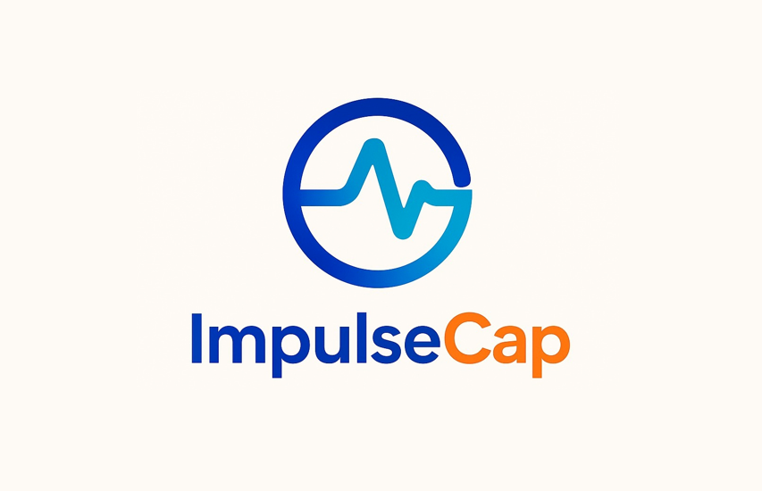
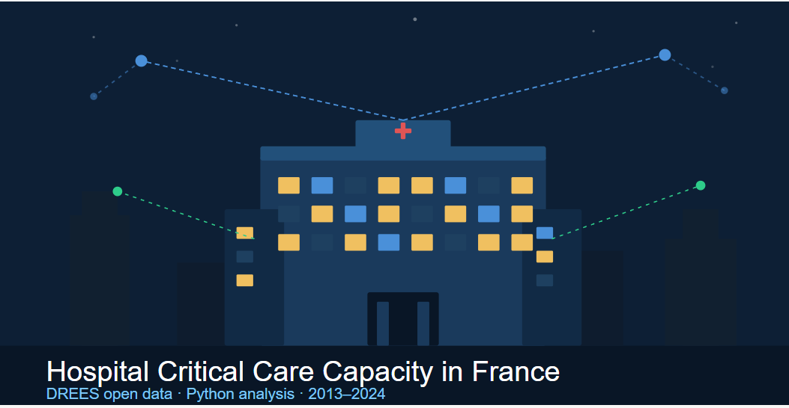

## Overview

This project was completed as part of the **MNA1017 Business Processes & Lean Thinking** module at Dublin City University during my Erasmus exchange. Acting as a Lean management consultant, I proposed a structured improvement plan for a fictional but realistic large urban Irish teaching hospital (500 beds, 80,000 annual ED presentations) facing persistent delays despite adequate staffing.

::: {.callout-note}
## Context
In Ireland, the National Emergency Medicine Programme targets 95% of patients admitted or discharged within six hours. The hospital in this case study had average waiting times exceeding four hours, driven not by capacity constraints but by fragmented processes and disorganised workspaces.
:::

---

## Methodology

Three core Lean tools were applied:

| Tool | Purpose |
|------|---------|
| **Value Stream Mapping (VSM)** | Map the full patient journey and identify waste |
| **Kaizen** | Continuous improvement through focused, staff-led events |
| **5S** | Reorganise physical workspaces to reduce motion waste |

---

## Patient Flow - Value Stream Map

**Before Lean implementation** - Total lead time: 310 min (23% value-added)

```{mermaid}
flowchart LR
    A[Registration & Triage\n⏱ 25 min] --> B[Nurse Preparation\n⏱ 20 min]
    B --> C[Wait for Physician\n⏱ 85 min]
    C --> D[Physician Assessment\n⏱ 30 min]
    D --> E[Wait for Results\n⏱ 130 min]
    E --> F[Nurse Finalisation\n⏱ 20 min]
    F --> G[Discharge/Admission]
```

**After Lean implementation** - Total lead time: ~200 min (40% value-added)

```{mermaid}
flowchart LR
    A[Registration & Triage\n⏱ 25 min] --> B[Nurse Preparation\n⏱ 20 min]
    B --> C[Wait for Physician\n⏱ 40 min]
    C --> D[Physician Assessment\n⏱ 30 min]
    D --> E[Wait for Results\n⏱ 55 min]
    E --> F[Nurse Finalisation\n⏱ 20 min]
    F --> G[Discharge/Admission]
```

---

## Key Findings

The current-state VSM revealed three major bottlenecks:

- **85-minute wait** before physician assessment
- **130-minute wait** for diagnostic results
- Only **23% of total lead time** adds value from the patient's perspective

These patterns mirror findings from Sánchez et al. (2018), who reported similar inefficiencies in a Barcelona ED resolved through Lean without additional staff or beds.

---

## Recommendations

Three focused Kaizen events were proposed:

1. **Triage-to-assessment handoff** : standardise communication to reduce the 85-minute wait
2. **Diagnostic ordering pathway** : move test ordering earlier to run in parallel with assessment
3. **Discharge coordination** : streamline documentation between ED and admitting departments

A **5S programme** was also proposed for nursing stations, treatment bays and equipment storage, targeting the motion waste identified in the VSM.

---

## Projected Outcomes

| Metric | Before | After |
|--------|--------|-------|
| Total lead time | 310 min | ~200 min |
| Value-added time | 23% | ~40% |
| Wait for physician | 85 min | ~40 min |
| Wait for results | 130 min | ~55 min |

::: {.callout-tip}
## Evidence base
Sánchez et al. (2018) reported a 32.4% reduction in waiting time in a comparable Lean intervention. Huang et al. (2022) observed a 36.9% drop in waiting time after implementing 5S in an emergency pharmacy.
:::

---

## Key Takeaways

This project strengthened my ability to apply structured process improvement frameworks to real-world healthcare operations. Mapping patient flows, identifying waste, and proposing evidence-based solutions are skills directly applicable to MOA and PMO roles in the health sector, where understanding clinical processes is as important as managing the project itself.

---

::: {.project-nav}
## Other Projects

::: {.grid}

::: {.g-col-4 .project-nav-card}
[](eu-ai-act.qmd)

[**EU AI Act**](eu-ai-act.qmd)

AI regulation and compliance analysis
:::

::: {.g-col-4 .project-nav-card}
[](impulsecap.qmd)

[**ImpulseCap**](impulsecap.qmd)

Adaptive fitness app for people with disabilities
:::

::: {.g-col-4 .project-nav-card}
[](python_analysis.qmd)

[**Hospital Critical Care**](python_analysis.qmd)

Python data analysis of French health data
:::

:::
:::